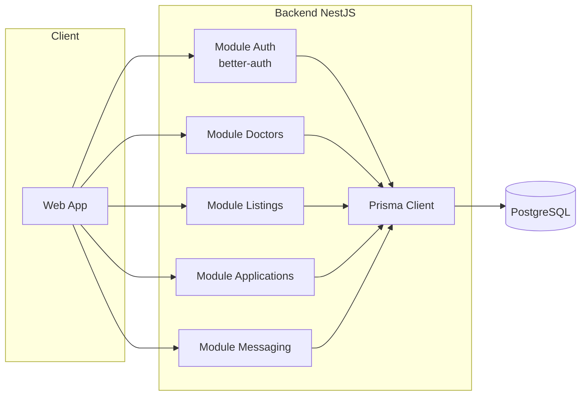
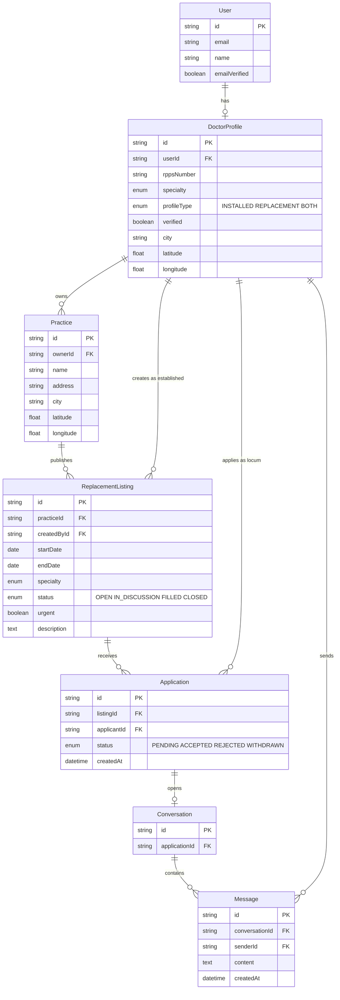
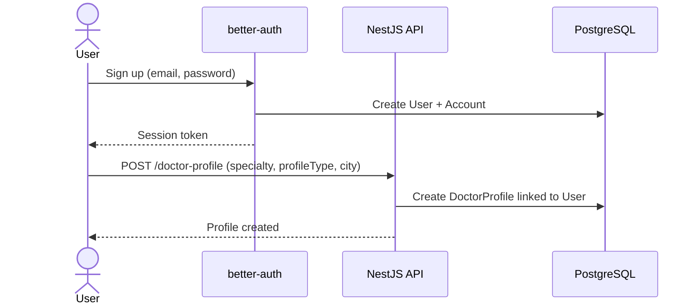
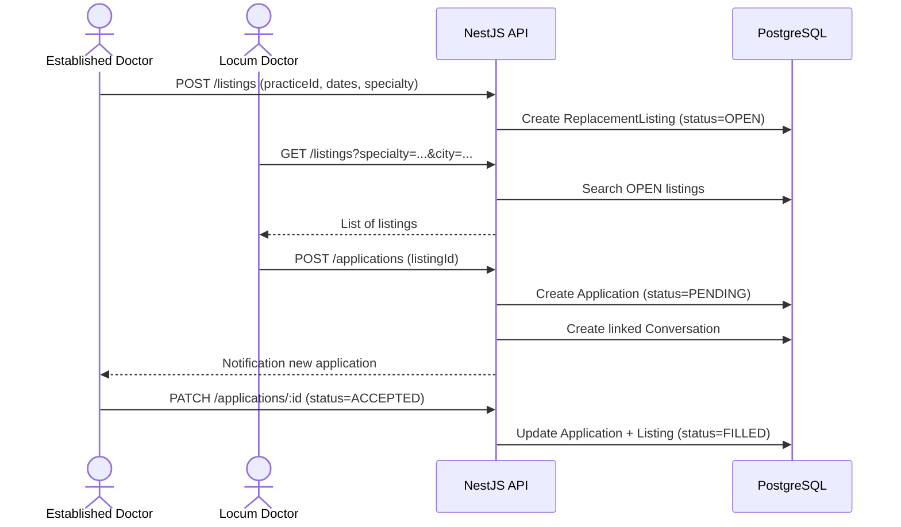
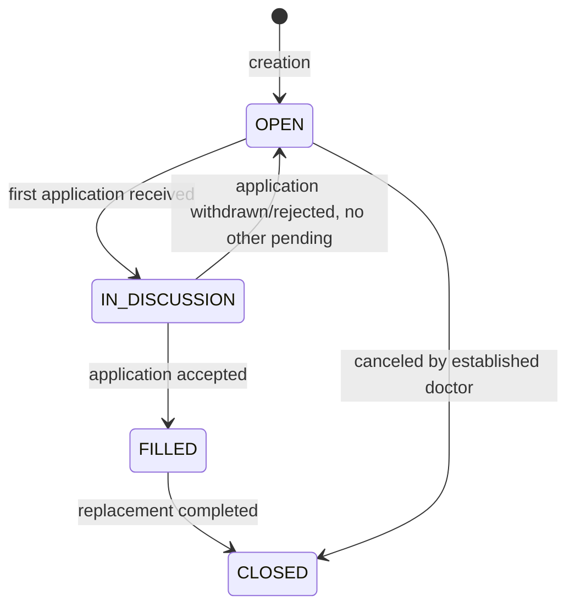

# Kineo

Application connecting established doctors with locum doctors (replacements) in France, with a differentiating positioning focusing on administrative automation (contracts, RPPS verification, statuses) rather than just simple job listings.

This document serves both as a product specification for a human and as context for an AI taking over the code (architecture, entities, flows, conventions). This specifically targets the **backend** of the fullstack project.

---

## 1. Context and Positioning

The market already includes established players:
- **MonRempla / Rempla** (regional network backed by CNOM) — leader, verification via the Medical Council.
- **RemplaMed, MesRemplas, Remplaclinic, RemplaJob** — private actors, classic matchmaking.

**Targeted differentiation**: reduce administrative friction rather than simply duplicating matchmaking.

| Axis | Description |
|---|---|
| Verification | RPPS / Medical Council status verified at registration (declarative in MVP, official API in V2) |
| Contract | Automatic generation of standard locum contract (pre-filled PDF) |
| Emergency | "Last-minute replacement" mode with alerts to nearby available locums |
| Reputation | Bilateral rating after replacement (Airbnb-style) |
| Niche | Initial targeting of a specific specialty or restricted geographical area, not a generalized national coverage |

**MVP scope** (minimal functional perimeter):
1. Registration / authentication (established doctor or locum)
2. Doctor profile (specialty, status, geographical area)
3. Publishing a replacement listing (practice, dates, specialty)
4. Search / apply for a listing
5. Basic messaging between the two parties
6. Listing status (open → in discussion → filled → closed)

Out of MVP scope: contract generation, payment, real-time RPPS API verification, rating.

---

## 2. Tech Stack

- **Backend**: NestJS (TypeScript)
- **ORM**: Prisma (`provider = postgresql`)
- **Auth**: better-auth (email/password + sessions, extensible OAuth)
- **Database**: PostgreSQL
- **Frontend**: TBD (not started)

---

## 3. Global Architecture

---

## 4. Data Model

### 4.1 Current State (better-auth)

The existing Prisma schema only covers authentication, generated by better-auth:

- `User`: base identity (email, name, image)
- `Session`: active sessions
- `Account`: linked accounts (credentials or OAuth)
- `Verification`: verification tokens (email, password reset)
- `Jwks`: keys for JWT signing

### 4.2 Proposed Business Extension

---

## 5. Main Flows

### 5.1 Registration and Profile Creation

### 5.2 Listing Publication and Application

### 5.3 Listing Lifecycle

---

## 7. Roadmap

- [x] Auth (better-auth + Prisma)
- [x] DoctorProfile Module
- [x] Practice Module
- [x] ReplacementListing Module (CRUD + search by city/specialty)
- [ ] Application Module (application + acceptance)
- [ ] Messaging Module (conversation linked to an application)
- [ ] Frontend (TBD)
- [ ] V2: RPPS verification via official API, PDF contract generation, bilateral rating, geolocated "emergency" alerts

---

## 8. Notes for AI Takeover

- The `User`, `Session`, `Account`, `Verification`, `Jwks` models are managed by better-auth: do not modify them manually, regenerate via the better-auth CLI if additional fields are needed on `User`.
- All business data (specialty, status, location) goes into `DoctorProfile`, not in `User`, to avoid interfering with auto-generated better-auth migrations.
- Prisma enums (`Specialty`, `ListingStatus`, etc.) are intentionally simple in the MVP; plan for progressive extension rather than initial over-engineering.
- No payment or legal contract logic is implemented yet: to be handled in V2 with particular vigilance on compliance (GDPR, health data indirectly linked via RPPS).