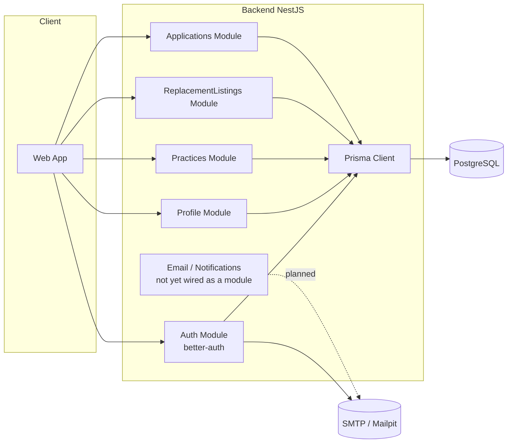
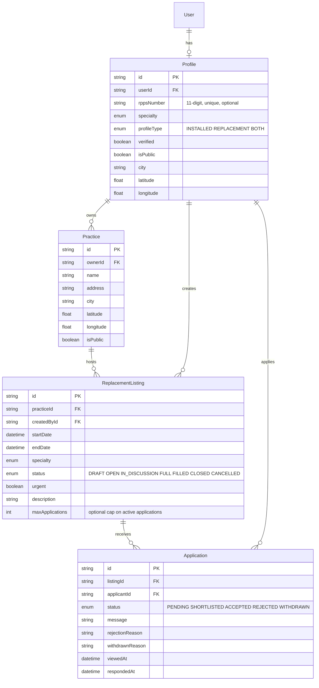
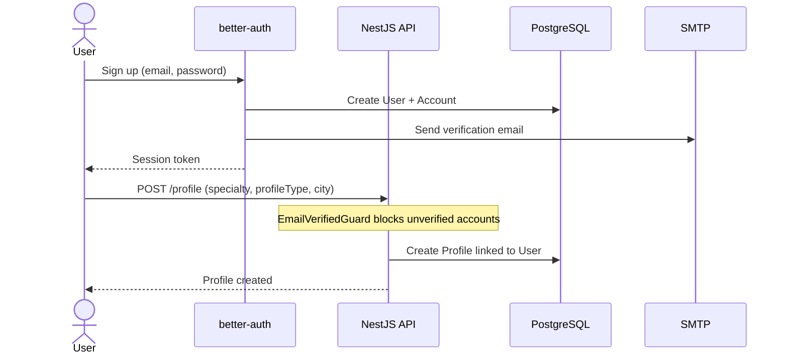
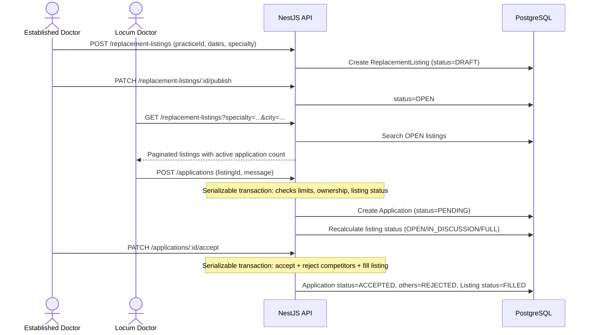
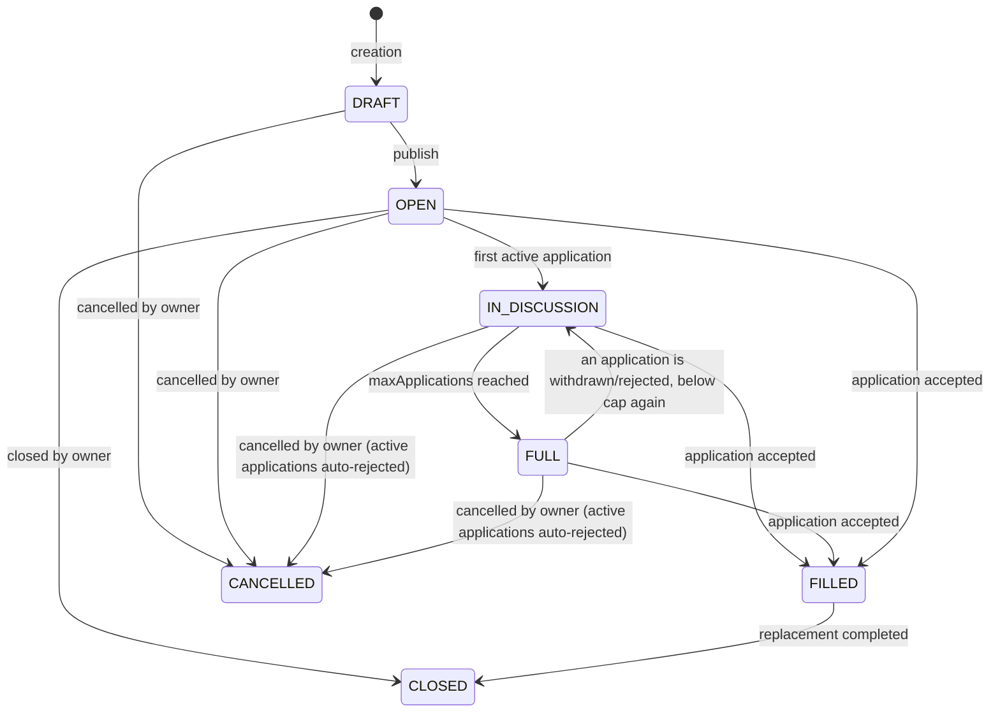
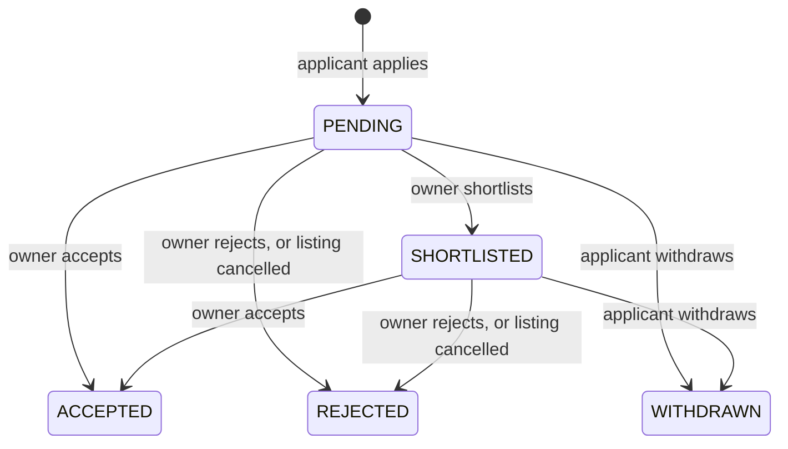

# Kineo

Application connecting established doctors with locum doctors (replacements) in France, with a differentiating positioning focusing on administrative automation (contracts, RPPS verification, statuses) rather than just simple job listings.

This document serves both as a product specification for a human and as context for an AI taking over the code (architecture, entities, flows, conventions). This specifically targets the **backend** of the fullstack project.

---

## 1. Context and Positioning

The market already includes established players:
- **MonRempla / Rempla** (regional network backed by CNOM) — leader, verification via the Medical Council.
- **RemplaMed, MesRemplas, Remplaclinic, RemplaJob** — private actors, classic matchmaking.

**Targeted differentiation**: reduce administrative friction rather than simply duplicating matchmaking.

| Axis | Description |
|---|---|
| Verification | RPPS / Medical Council status verified at registration (declarative in MVP, official API in V2) |
| Contract | Automatic generation of standard locum contract (pre-filled PDF) |
| Emergency | "Last-minute replacement" mode with alerts to nearby available locums |
| Reputation | Bilateral rating after replacement (Airbnb-style) |
| Niche | Initial targeting of a specific specialty or restricted geographical area, not a generalized national coverage |
| Communication | Applicants are never left in the dark: viewed/responded timestamps, shortlist status, and explicit rejection/withdrawal reasons |

**MVP scope** (minimal functional perimeter):
1. Registration / authentication (established doctor or locum)
2. Doctor profile (specialty, status, geographical area)
3. Publishing a replacement listing (practice, dates, specialty)
4. Search / apply for a listing
5. Application lifecycle with transparent status tracking (no messaging/conversation module yet)
6. Listing status (draft → open → in discussion → full → filled → closed/cancelled)

Out of MVP scope: contract generation, payment, real-time RPPS API verification, rating, messaging/conversation module.

---

## 2. Tech Stack

- **Backend**: NestJS (TypeScript), running on Bun
- **ORM**: Prisma (`provider = postgresql`, driver adapter `@prisma/adapter-pg`)
- **Auth**: better-auth (email/password + sessions, optional JWT plugin, email verification)
- **Validation**: Zod via `nestjs-zod` (DTOs, response serialization, auto-generated OpenAPI schemas)
- **Email**: Nodemailer (SMTP), Mailpit for local dev
- **Database**: PostgreSQL
- **Security**: Helmet, `@nestjs/throttler` (multi-tier rate limiting), CORS, serializable transactions for concurrency-sensitive writes
- **Frontend**: TanStack Router + React (early scaffolding only, not covered by this document)

---

## 3. Global Architecture

---

## 4. Data Model

### 4.1 Auth (better-auth)

- `User`: base identity (email, name, `emailVerified`, image)
- `Session`, `Account`, `Verification`: managed by better-auth
- `Jwks`: only used if the optional JWT plugin is enabled (`JWT_ENABLED=true`)

### 4.2 Business Model (implemented)

**Not implemented**: `Conversation`/`Message` (messaging module), originally planned in the ERD, is out of scope for now — deferred until a real need emerges.

---

## 5. Main Flows

### 5.1 Registration and Profile Creation

> **Email links**: links sent by Better Auth emails (email verification, password
> reset) are rewritten to the Next.js frontend pages (`/verify-email`,
> `/reset-password`) using the `FRONTEND_URL` variable. The frontend pages then
> complete the flow through `authClient`, which proxies `/api/auth/*` to the
> NestJS API — the API remains the single authentication server and all
> endpoints are unchanged.
>
> The API also exposes a custom Better Auth endpoint, `GET
> /api/auth/check-email-verification?token=…`: given a verification token (even
> an expired or already-used one) it reports whether the account is already
> verified. The `/verify-email` page uses it to show the success screen when a
> user re-clicks an old email link, and the signup page displays a “check your
> inbox” confirmation with a resend action after registration.

### 5.2 Listing Publication and Application

### 5.3 Listing Lifecycle

### 5.4 Application Lifecycle

---

## 6. Security & Reliability

Covered by an internal audit (`SECURITY-AUDIT.md`), mostly resolved:

- **Access control**: ownership checks on every mutating route across all four modules; `404` (not `403`) returned for private resources to avoid enumeration.
- **Concurrency**: `Serializable` isolation level with automatic retry (`common/serializable-transaction.ts`) on every write that touches shared counters (application limits, listing capacity, accept/reject cascades).
- **Rate limiting**: multi-tier throttling (`short`/`medium`/`long`) via `@nestjs/throttler`, with stricter limits on `create` routes; proxy-aware IP tracking.
- **Input validation**: length/range constraints on every Zod DTO (text fields capped, coordinates bounded, RPPS format-checked); per-profile resource caps configurable via env vars (`MAX_PRACTICES_PER_PROFILE`, `MAX_ACTIVE_LISTINGS_PER_PROFILE`, `MAX_ACTIVE_APPLICATIONS_PER_PROFILE`).
- **Transport security**: Helmet with a CSP scoped to allow the Scalar-based Swagger UI; CORS restricted to `TRUSTED_ORIGINS`.
- **Email**: no more plaintext token logging; real SMTP delivery (auth + TLS aware) with error handling that never blocks the underlying business transaction.
- **Indexes**: composite and partial indexes aligned with actual query patterns (`status`-filtered lookups on listings/applications, bounding-box geo search on practices).

Not yet done: automated tests (unit/e2e) beyond a single transactional test on `accept()`; production stack-trace leak has not been manually verified; email notifications on status changes are written (templates + mailer) but not yet wired into `ApplicationsService` — planned as a dedicated `NotificationsModule`.

---

## 7. Roadmap

- [x] Auth (better-auth + Prisma, optional JWT, email verification, password reset)
- [x] Profile Module (CRUD, public/private visibility, pagination, RPPS format validation)
- [x] Practice Module (CRUD, geo search with bounding-box pre-filter)
- [x] ReplacementListing Module (full lifecycle, capacity threshold, geo/date/specialty search)
- [x] Application Module (apply, shortlist, accept/reject cascade, withdraw, view tracking)
- [x] Security hardening (throttling, Helmet, CORS, indexes, input validation, concurrency safety)
- [ ] Email notifications wired into the application lifecycle (`NotificationsModule`)
- [ ] Automated test suite (unit + e2e)
- [ ] Messaging Module (conversation linked to an application) — deferred, not MVP-critical
- [ ] Frontend (early TanStack Router scaffolding only)
- [ ] V2: RPPS verification via official API, PDF contract generation, bilateral rating, geolocated "emergency" alerts

---

## 8. Notes for AI Takeover

- The `User`, `Session`, `Account`, `Verification`, `Jwks` models are managed by better-auth: do not modify them manually, regenerate via the better-auth CLI if additional fields are needed on `User`.
- All business data (specialty, status, location) lives in `Profile`, not in `User`.
- `email-verified.guard.ts` must be applied on **controllers**, not services — Nest guards have no effect on plain service methods.
- Every service that needs to check resource ownership uses the shared helpers in `common/profile-lookup.ts` rather than duplicating `findUnique` logic.
- Any write that reads-then-writes a shared counter (application count, listing capacity) must go through `runSerializableTransaction` (`common/serializable-transaction.ts`) to avoid race conditions.
- Zod entity schemas use `z.iso.datetime()` for date fields exposed to Swagger — plain `z.date()` breaks OpenAPI generation (`nestjs-zod` / Zod v4 limitation) and must not be reintroduced.
- No payment or legal contract logic is implemented yet: to be handled in V2 with particular vigilance on compliance (GDPR, health data indirectly linked via RPPS).